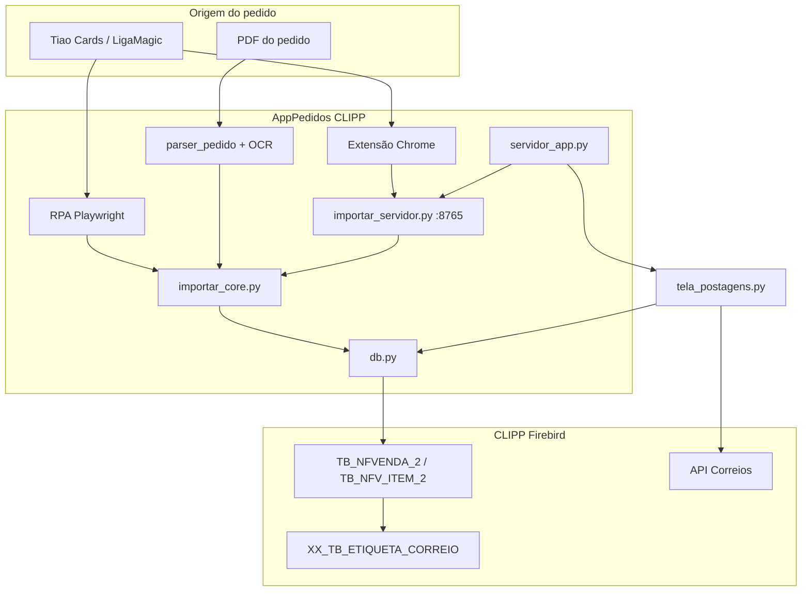

# AppPedidos CLIPP — Documentação do Projeto

Integração entre pedidos do site **Tiao Cards / LigaSegura** e o ERP **CLIPP** (Firebird), com servidor local, extensão Chrome e módulo de **postagens Correios**.

---

## Índice

1. [Visão geral](#1-visão-geral)
2. [Arquitetura e fluxos](#2-arquitetura-e-fluxos)
3. [Aplicações e pontos de entrada](#3-aplicações-e-pontos-de-entrada)
4. [Módulos Python — núcleo](#4-módulos-python--núcleo)
5. [Módulos Python — importação](#5-módulos-python--importação)
6. [Módulos Python — Correios](#6-módulos-python--correios)
7. [Extensão Chrome](#7-extensão-chrome)
8. [Banco de dados e schema](#8-banco-de-dados-e-schema)
9. [Configuração (`config.ini`)](#9-configuração-configini)
10. [Instalador e atualização](#10-instalador-e-atualização)
11. [Scripts auxiliares e arquivos `.bat`](#11-scripts-auxiliares-e-arquivos-bat)
12. [Regras de negócio na importação](#12-regras-de-negócio-na-importação)
13. [Pastas e arquivos de dados](#13-pastas-e-arquivos-de-dados)

---

## 1. Visão geral

O projeto resolve três problemas do dia a dia da loja:

| Problema | Solução |
|----------|---------|
| Digitar pedidos do site no CLIPP | Importação automática (HTML do painel ou PDF via OCR) |
| Acompanhar o que já foi importado | Controle local (`pedidos_rpa.json`) + checagem no Firebird |
| Emitir etiquetas e controlar frete | Fila `XX_TB_ETIQUETA_CORREIO` + API Correios + abas no servidor |

**Stack:** Python 3.10+, Tkinter (interface), Firebird (`fdb`), Playwright (RPA legado), `requests` (API Correios), extensão Chrome MV3.

---

## 2. Arquitetura e fluxos



### Fluxo principal — extensão (uso diário)

1. Servidor sobe com o Windows (`servidor_app.py` na bandeja).
2. Usuário abre o pedido no Chrome (já logado).
3. Extensão lê o HTML da página e envia `POST /import` para `127.0.0.1:8765`.
4. `importar_servidor` chama `rpa.extrair_pedido_html` → `importar_core.importar_de_html`.
5. `db.py` grava cliente, venda pendente e itens no Firebird.
6. Usuário confere e finaliza a venda no gerencial CLIPP.

### Fluxo — etiqueta Correios

1. NF-e modelo 55 é autorizada no CLIPP → trigger `TB_NFE_ETIQUETA_AIU` enfileira registro em `XX_TB_ETIQUETA_CORREIO`.
2. Aba **Postagens** lista a fila, permite editar serviço/peso/embalagem.
3. Ao gerar etiqueta: `correios_api` cria pré-postagem, aguarda status, solicita e baixa PDF do rótulo.
4. Sincronização de rastreio atualiza status (GERADA → POSTADO → ENTREGUE).
5. Aba **Financeiro** consulta `valorAtendimento` na API e grava em `VL_POSTAGEM`.

---

## 3. Aplicações e pontos de entrada

| Entrada | Arquivo | O que faz |
|---------|---------|-----------|
| **Produção (bandeja)** | `servidor_app.py` | Janela + ícone na bandeja, HTTP local, abas Correios |
| `AppPedidos CLIPP.bat` | — | Atalho para subir o servidor com `pythonw` |
| **Importador PDF (legado)** | `aplicacao_vendas.py` | Interface para OCR de PDFs e importação manual |
| **RPA terminal** | `importar_site.py` | Playwright: extrai pedido(s) do site sem extensão |
| **Servidor HTTP isolado** | `importar_servidor.py` | Só a API REST (usado embutido no `servidor_app`) |
| **Teste OCR** | `extrator_ocr.py` | Lê um PDF e imprime JSON no terminal |
| **Diagnóstico** | `comparar_vendas_clipp.py` | Compara duas vendas no banco (importada vs manual) |

---

## 4. Módulos Python — núcleo

### `config.py`

Gerencia **`config.ini`** e caminhos do aplicativo.

| Bloco | Função |
|-------|--------|
| `DEFAULTS` | Valores padrão das seções: `firebird`, `ocr`, `nfvenda`, `venda`, `rpa`, `extensao`, `clipp`, `correios` |
| `app_dir()` | Pasta onde está o código |
| `dados_dir()` | Pasta gravável (projeto ou `%LOCALAPPDATA%\AppPedidosCLIPP`) |
| `log_path()` | `servidor_clipp.log` |
| `pedidos_controle_path()` | `pedidos_rpa.json` — pedidos já importados pela extensão/RPA |
| `load_config()` / `save_config()` | Leitura e gravação do INI |
| `get_db_config()` | Dict pronto para `db.conectar()` |
| `get_correios_config()` | Credenciais e remetente para API Correios |
| `mensagem_config_banco()` | Valida se o banco está configurado antes de importar |

### `limites_campos.py`

Constantes de tamanho máximo dos campos do CLIPP (`TB_CLIENTE`, etc.), usadas ao truncar/normalizar dados vindos do site ou PDF.

### `schema_app.py`

**Migração automática do banco** na primeira conexão de cada sessão.

| Bloco | Função |
|-------|--------|
| `TB_APPPEDIDOS_IMPORT_ERRO` | Log de erros e itens não importados |
| `garantir_schema_etiqueta_correio()` | Tabela `XX_TB_ETIQUETA_CORREIO`, status, triggers de fila e proteção de exclusão |
| `garantir_schema_embalagem_correio()` | Tabela `XX_TB_EMB_CORREIO` (dimensões de embalagens) |
| `garantir_procedure_inc_pdv_pedv()` | Atualiza procedure que copia OBS da NF para `TB_PEDIDO_VENDA` |
| `garantir_schema_apppedidos()` | Orquestra todas as migrações |
| `gravar_erro_import()` / `gravar_itens_faltantes_import()` | Persistência de falhas de importação |

Referência SQL manual: `sql/xx_tb_etiqueta_correio.sql`, `sql/xx_tb_emb_correio.sql`, `sql/xx_inc_pdv_pedv_atualizada.sql`.

### `db.py`

Camada de acesso ao **Firebird** (~5.000 linhas). Organizado em blocos lógicos:

#### Conexão e commit

| Função | Função |
|--------|--------|
| `carregar_fbclient()` | Carrega `fbclient.dll` (32/64 bits) |
| `conectar()` / `encerrar_conexao()` | Abre/fecha conexão com schema garantido |
| `_commit_gravacao()` / `_finalizar_gravacao_visivel_clipp()` | Commit com “pulso” para o CLIPP enxergar alterações |
| `_garantir_schema_once()` | Chama `schema_app` uma vez por processo |

#### Cliente

| Função | Função |
|--------|--------|
| `buscar_cliente()` | Busca por nome + telefone ou documento |
| `cadastrar_cliente()` / `completar_cliente()` | Cadastro novo ou preenchimento de campos vazios |
| `normalizar_endereco_cliente()` | Separa logradouro, CEP, bairro conforme limites CLIPP |
| `buscar_id_cidade()` | Resolve `ID_CIDADE` em `TB_CIDADE_SIS` |
| `resolver_cliente()` | Orquestra busca → completar → cadastrar |

#### Produto / estoque

| Função | Função |
|--------|--------|
| `buscar_produto()` | Ponto de entrada: referência de carta ou SKU selado |
| `_buscar_detalhe_v_estoque()` | Busca em views de estoque por referência |
| `_buscar_detalhe_sku()` | Produtos selados (YG/YGO…) |
| `_id_grupo2_por_raridade()` | Desambigua cartas do grupo Yu-Gi-Oh por raridade |
| `listar_produtos_semelhantes()` | Candidatos para resolução manual na extensão |

#### Venda e importação

| Função | Função |
|--------|--------|
| `importar_cliente_fase()` | Fase 1: só cliente |
| `importar_pedido_fase()` | Fase 2: venda + itens + observações |
| `consultar_venda_por_numero_pedido()` | Localiza venda pelo nº do pedido nas OBS |
| `sincronizar_controle_pedido_clipp()` | Alinha `pedidos_rpa.json` com o banco |
| `inserir_item_resolvido_venda()` | Grava item escolhido manualmente na extensão |
| `desfazer_importacao()` | Remove venda importada (quando permitido) |

#### Etiquetas e Correios

| Função | Função |
|--------|--------|
| `listar_etiquetas_correio()` | Grade da aba Postagens (filtros, status) |
| `listar_status_etiqueta()` | Domínio `XX_TB_ETQ_STATUS` |
| `obter_dados_envio_etiqueta()` | Monta payload destinatário + dimensões |
| `atualizar_etiqueta_prepostagem()` | Grava ID pré-postagem, rastreio, PDF, status |
| `atualizar_parametros_etiqueta()` | Override de serviço, peso, embalagem na grade |
| `salvar_embalagem()` / `excluir_embalagem()` | CRUD `XX_TB_EMB_CORREIO` |
| `listar_financeiro_correio()` | Postagens do mês para aba Financeiro |
| `buscar_e_gravar_valor_postagem()` | API `valorAtendimento` → `VL_POSTAGEM` |
| `obter_mes_ultima_postagem()` | Navegação automática no Financeiro |

#### Dataclasses

- `RegistroDesfazer` — IDs para rollback de importação
- `ItemFaltante` — item sem estoque correspondente
- `ResultadoImportacao` — resumo ok/erro/faltantes

---

## 5. Módulos Python — importação

### `parser_pedido.py`

Leitura de **PDF** via OCR (Tesseract + Poppler).

| Bloco | Função |
|-------|--------|
| Regex de referência | `REF_PADRAO`, variantes PT/FR/EN, legado `LOB-001` |
| `eh_sku_selado()` / `candidatos_sku_clipp()` | Distingue carta avulsa de produto selado |
| `montar_referencia_clipp()` | Converte `[PT]` → `-PT`, etc. |
| `PedidoExtraido` / `ItemPedido` | Estruturas de dados do pedido |
| `extrair_pedido_pdf()` | Pipeline OCR → texto → campos estruturados |

### `rpa_tiaocards.py`

Extração do **HTML do painel** Tiao Cards (usado pela extensão e pelo RPA).

| Bloco | Função |
|-------|--------|
| `extrair_pedido_html()` | Parser principal do HTML da página de detalhe |
| `extrair_pedido_site()` | Abre URL com Playwright e extrai |
| `listar_pedidos_pendentes()` | Lista pedidos «Aguardando envio» |
| Controle `pedidos_rpa.json` | Evita reimportar o mesmo pedido |
| `STATUS_IMPORTAR` | Filtro: só «Pagamento efetuado - Aguardando envio» |

### `importar_core.py`

**Orquestrador** compartilhado (extensão, RPA, servidor).

| Função | Função |
|--------|--------|
| `importar_de_html()` | HTML → `PedidoExtraido` → banco |
| `importar_pedido_extraido()` | Grava pedido já parseado; trata bloqueio de reimportação |
| `resolver_produto_faltante()` | Endpoint da extensão para item sem estoque |
| `pedido_no_clipp()` | Verifica se pedido já existe |
| `_enriquecer_faltantes()` | Adiciona candidatos de produto para UI da extensão |

### `importar_servidor.py`

**Servidor HTTP** local (porta 8765 por padrão).

| Rota | Método | Função |
|------|--------|--------|
| `/ping`, `/health` | GET | Status e versão |
| `/import`, `/importar` | POST | Importa HTML do pedido |
| `/controle/limpar` | POST | Limpa `pedidos_rpa.json` |

O handler também aceita `resolver_produto` no POST para gravar item escolhido na extensão.

### `aplicacao_vendas.py`

Interface **desktop legada** para importação por PDF.

| Classe | Função |
|--------|--------|
| `ConfigDialog` | Primeira configuração (banco, OCR) |
| `ImportadorApp` | Lista PDFs, preview, importação em lote |

### `servidor_app.py`

**Aplicação principal em produção.**

| Bloco | Função |
|-------|--------|
| `_configurar_log()` | Log em arquivo (pythonw sem console) |
| `_criar_icone_tray()` | Ícone na bandeja do Windows |
| `_inicio_automatico_ativo()` | Registro no Run / Startup |
| `_iniciar_servidor()` / `_parar_servidor()` | Thread HTTP em background |
| `_recarregar_servico()` | Hot-reload dos módulos Python sem reiniciar o EXE |
| `JanelaServidor` | Tkinter: aba Servidor + abas Correios |
| Abas | Postagens, Financeiro, Consultar Correios, Embalagens |

Módulos recarregáveis: `config`, `db`, `importar_core`, `schema_app`, etc.

---

## 6. Módulos Python — Correios

### `correios_api.py`

Cliente da **API Correios (CWS)**.

| Bloco | Função |
|-------|--------|
| `HOSTS` | Produção vs homologação |
| `SERVICOS` | SEDEX, PAC, Mini Envios (códigos do contrato) |
| `CorreiosClient` | Classe principal |
| `obter_token()` | JWT por cartão de postagem (cache com renovação) |
| `criar_prepostagem()` | POST pré-postagem v1 |
| `aguardar_prepostado()` | Poll até status 2 (pré-postado) |
| `solicitar_rotulo()` / `baixar_rotulo()` | Fluxo assíncrono do PDF (recibo) |
| `gerar_rotulo_pdf()` | Orquestra solicitar + aguardar + salvar arquivo |
| `consultar_postagem()` | Valor tarifado após postagem (`valorAtendimento`) |
| `rastrear()` | Eventos de rastreio |
| `RotuloRefazerError` | PPN-295 / timeout — pedir novo recibo |

Credenciais: seção `[correios]` do `config.ini` (usuário, código de acesso, cartão, remetente).

### `tela_postagens.py`

Interface da aba **Postagens (Correios)** (~3.100 linhas).

| Bloco | Função |
|-------|--------|
| `_classificar_situacao()` | Interpreta rastreio: evita marcar POSTADO só com «Etiqueta emitida» |
| `PostagensFrame` | Grade principal: fila, filtros, sync, geração em lote |
| `EmbalagensFrame` | Cadastro de embalagens (dimensões padrão) |
| `ConsultaCorreiosFrame` | Consulta avulsa de pré-postagem/rastreio |
| `DialogoGerarEtiqueta` | Confirma parâmetros antes de gerar |
| `preparar_envio_etiqueta()` | Monta dados para API a partir do registro + NF |
| `_tick_bg_rotulos` | Download de PDFs em segundo plano |
| `_buscar_valor_postagem_bg()` | Grava `VL_POSTAGEM` ao detectar POSTADO |

Colunas editáveis na grade: **Envio** (combo), **Peso**, **Embalagem**.

### `tela_financeiro.py`

Aba **Financeiro — Contrato Correios**.

| Bloco | Função |
|-------|--------|
| `ultimo_dia_util_mes()` | Referência de fechamento do contrato |
| `FinanceiroFrame` | Navegação por mês, cards de total/qtd/pendentes |
| `recarregar()` | Lista POSTADO/ENTREGUE; na 1ª abertura vai ao mês da última postagem |
| `_acao_buscar_valores()` | Consulta API para etiquetas sem `VL_POSTAGEM` |

---

## 7. Extensão Chrome

Pasta: `extensao_chrome/`

| Arquivo | Função |
|---------|--------|
| `manifest.json` | MV3, permissões `tiaocards.com.br`, `ligamagic.com.br`, `127.0.0.1` |
| `popup.html` / `popup.js` | UI: importar página, status, resolver faltantes |
| `relatorio.html` / `relatorio.js` | Relatório de conferência (importado vs site) |

**Fluxo no popup:**

1. Lê HTML da aba ativa (`chrome.scripting`).
2. `GET /ping` — verifica se o servidor local está no ar.
3. `POST /import` com `{ html, url, numero_pedido }`.
4. Se houver itens faltantes, exibe lista com candidatos do estoque.
5. `POST /import` com `resolver_produto` para gravar escolha manual.

Instalação: `chrome://extensions` → Modo desenvolvedor → Carregar sem compactação.

Detalhes: `LEIA-ME-EXTENSAO.md`.

---

## 8. Banco de dados e schema

### Tabelas CLIPP (existentes)

| Tabela | Uso no projeto |
|--------|----------------|
| `TB_NFVENDA_2` | Venda importada (`FIM = 'Pendente'`) |
| `TB_NFV_ITEM_2` | Itens da venda |
| `TB_CLIENTE` / views | Cadastro e endereço de entrega |
| `TB_EST_PRODUTO_2` / views estoque | Resolução de referências e SKUs |
| `TB_NFE` | NF-e autorizada → dispara fila de etiqueta |
| `TB_PEDIDO_VENDA` | Campo OBS sincronizado via `XX_INC_PDV_PEDV` |

### Tabelas criadas pelo AppPedidos

| Tabela | Função |
|--------|--------|
| `XX_TB_ETIQUETA_CORREIO` | Fila de etiquetas (status, rastreio, PDF, `VL_POSTAGEM`, `ID_EMB`, dimensões) |
| `XX_TB_ETQ_STATUS` | Domínio de status com flag `BLOQUEIA_EXCLUSAO` |
| `XX_TB_EMB_CORREIO` | Embalagens pré-cadastradas (peso/dimensões) |
| `TB_APPPEDIDOS_IMPORT_ERRO` | Erros e itens não importados |

### Triggers importantes

| Trigger | Função |
|---------|--------|
| `TB_NFE_ETIQUETA_AIU` | Ao autorizar NF-e modelo 55, insere em `XX_TB_ETIQUETA_CORREIO` |
| `XX_TB_ETIQUETA_CORREIO_BI` | Generator do `ID_ETIQUETA` |
| `XX_TB_ETIQUETA_CORREIO_BD` | Impede exclusão de etiqueta impressa/postada |

### Status da etiqueta

```
PENDENTE → PROCESSANDO → GERADA → IMPRESSO → POSTADO → (ENTREGUE via sync)
                ↓
              ERRO / CANCELADA
```

---

## 9. Configuração (`config.ini`)

Arquivo na pasta do aplicativo. Exemplo em `config.ini.exemplo`.

| Seção | Campos principais |
|-------|-------------------|
| `[firebird]` | `database`, `user`, `password`, `fbclient_path`, `host`, `port` |
| `[ocr]` | `tesseract_cmd`, `poppler_path` (só importador PDF) |
| `[nfvenda]` | `id_sermod`, `nf_serie`, `nf_modelo` |
| `[venda]` | `id_vendedor`, `id_planoconta`, `cc_custo` |
| `[rpa]` | `base_url`, credenciais site (RPA legado) |
| `[extensao]` | `porta` (8765) |
| `[clipp]` | Grupos Yu-Gi-Oh/Pokémon, sets de raridade |
| `[correios]` | `usuario`, `codigo_acesso`, `cartao_postagem`, remetente completo |

O código de acesso dos Correios é gerado no **CWS** (Gestão de acesso a APIs), não é a senha do site.

---

## 10. Instalador e atualização

Pasta: `instalador/`

| Script | Função |
|--------|--------|
| `instalar.ps1` / `setup.iss` | Instalador completo com Python embutido |
| `gerar_atualizacao.ps1` | Gera `dist/AppPedidosCLIPP-Update.zip` (só código) |
| `atualizar_app.ps1` | Para o servidor, copia arquivos, reinicia |
| `Gerar ZIP (sem Defender).bat` | Atalho para ZIP de instalação |
| `Gerar Instalador.bat` | Atalho para Setup.exe |

**Atualização em produção:**

1. Extrair `AppPedidosCLIPP-Update.zip`
2. Executar `ATUALIZAR.bat` (admin se em Program Files)
3. Recarregar extensão no Chrome (`chrome://extensions`)

Detalhes: `LEIA-ME-INSTALACAO.md`.

---

## 11. Scripts auxiliares e arquivos `.bat`

| Arquivo | Função |
|---------|--------|
| `AppPedidos CLIPP.bat` | Inicia servidor na bandeja |
| `Servidor CLIPP (bandeja).bat` | Idem |
| `Servidor Extensao CLIPP.bat` | Só HTTP (sem janela completa) — legado |
| `Importar do Site.bat` | RPA via terminal |
| `Abrir Chrome RPA.bat` | Chrome com perfil `.rpa_profile` |
| `Corrigir Postagens (instalar requests).bat` | Instala dependência `requests` |
| `teste_prepostagem.py` | Teste manual da API Correios |
| `comparar_vendas_clipp.py` | Diff entre duas vendas |
| `extrator_ocr.py` | Teste de leitura de PDF |
| `_tmp_*.py` / `_backup_*` | Scripts temporários ou backup — não são runtime |

---

## 12. Regras de negócio na importação

Documentadas também em `.cursor/rules/importacao-pedidos.mdc`.

| Campo | Valor na importação |
|-------|---------------------|
| `FIM` | `Pendente` |
| `XX_ID_CAMP` | `2` |
| `ID_FMAPGTO` / `ID_PARCELA` | `1` (usuário altera ao finalizar) |
| `OBS` | Nº pedido + forma de pagamento |
| `ID_NATOPE` | `0` |
| `TIPO_FRETE` | `0` |
| `ENDERECO_ENTREGA` | `S` |
| `STATUS` | `A` |
| `ID_PAIS` (cliente) | `1058` |

**Cliente:** busca por nome exato + telefone; completa cadastro incompleto; não duplica.

**Cartas:** referência `-EN` + idioma `[PT]`/`[FR]` → `-PT`/`-FR` no estoque.

**Produtos selados:** match por SKU (variantes YG/YGO).

**Generators:** cada INSERT consome generators corretos do Firebird.

---

## 13. Pastas e arquivos de dados

| Caminho | Conteúdo |
|---------|----------|
| `config.ini` | Configuração (não sobrescrito no update) |
| `servidor_clipp.log` | Log da sessão atual |
| `pedidos_rpa.json` | Controle de pedidos importados |
| `faltantes/` | Relatórios `.txt` de itens sem estoque |
| `etiquetas/` | PDFs de rótulos gerados (cache) |
| `.rpa_profile/` | Perfil Chrome do RPA Playwright |
| `instalador/dist/` | ZIPs de instalação e atualização |
| `sql/` | Scripts SQL de referência |
| `extensao_chrome/` | Extensão para carregar no Chrome |

---

## Dependências Python

**Runtime servidor:** `servidor-requirements.txt`  
**Importador PDF / RPA:** `requirements.txt`

Principais: `fdb`, `requests`, `Pillow`, `pypdf`, `playwright`, `pytesseract`, `pdf2image`.

---

## Documentos relacionados

| Arquivo | Conteúdo |
|---------|----------|
| `LEIA-ME.md` | Início rápido (importador PDF) |
| `LEIA-ME-INSTALACAO.md` | Instalação Windows, Defender, bandeja |
| `LEIA-ME-EXTENSAO.md` | Extensão Chrome vs RPA |
| `.cursor/rules/importacao-pedidos.mdc` | Regras para o agente de IA |
| `DOCUMENTACAO.md` | Este arquivo — referência completa |
